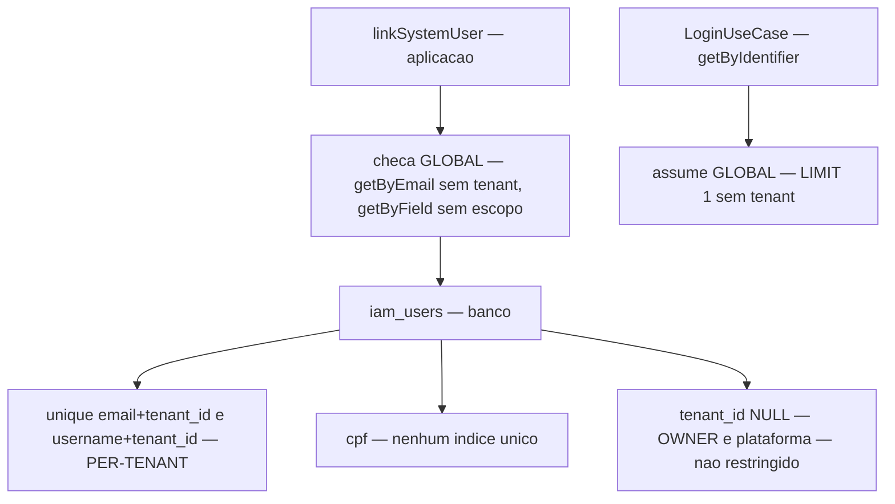

# 0011 — Unicidade de identidade global

**Situação:** Aceita
**Data:** 2026-10-01
**Origem:** Revisão da persistência de profissionais e colaboradores ([`cadastros.md`](../cadastros.md))

## Contexto

O cadastro de profissionais e colaboradores cria a conta de acesso da pessoa em `iam_users` — é o que diz [`cadastros.md`](../cadastros.md). Faltava decidir se **e-mail**, **CPF** e **username** deveriam ser únicos **por tenant** ou **em toda a aplicação**.

Três características do sistema delimitam a pergunta:

- A aplicação está preparada para multitenant, mas será monotenant na maioria dos casos.
- O OWNER (superadministrador) tem acesso completo, independente de tenant.
- O ADMIN atua apenas no seu tenant: não cadastra nem vê dados de outro. O mesmo vale para o USER.

O que decidiu a questão não foi preferência de modelagem, e sim o fluxo de autenticação. `LoginUseCase` recebe **apenas** `identifier` e `password` — não há tenant na requisição — e `UserRepository.getByIdentifier` resolve com `email OR username OR cpf`, sem filtro de tenant e com `LIMIT 1`. Com dois registros respondendo ao mesmo identificador, a resolução passa a ser **não-determinística**: a linha devolvida é arbitrária, e o titular legítimo pode receber "senha inválida" enquanto o contador de tentativas de acesso sobe. Unicidade global não era, portanto, uma preferência: era **pré-requisito de corretude do login**.

Havia ainda uma inconsistência entre as camadas:



A aplicação checava globalmente, o banco garantia apenas por tenant, e o CPF não tinha índice único algum. Como as checagens eram *check-then-insert*, dois escritores concorrentes passavam por ambas e o banco aceitava: o invariante global era **violável na prática**. Além disso, um índice único composto trata `NULL` como distinto, de modo que contas de plataforma — `tenant_id NULL`, o OWNER entre elas — não eram restringidas nem por tenant.

## Decisão

A unicidade de `email`, `username` e `cpf` é **global**, não por tenant.

- **`username`** é credencial interna: existe apenas para resolver login, e o login é global.
- **`cpf`** é identificador nacional do indivíduo e **também credencial aceita** por `getByIdentifier` (11 dígitos). Duplicá-lo cria sombreamento de login entre pessoas.
- **`email`** é a âncora de recuperação de senha e de notificação, resolvida globalmente.

A decisão vale para a **conta de acesso** (`iam_users`) — não para os cadastros de negócio. Cada usuário continua pertencendo a **um único tenant**, e `app_practitioners`, `app_staff` e `app_patients` permanecem com escopo de tenant, como já eram.

Isso resolve a aparente contradição com [`cadastros.md`](../cadastros.md), que diz ser o CPF do **paciente** único *na organização*: o paciente é registro de negócio, e aquele CPF não é credencial de login. Já o CPF do profissional e o do colaborador **são** o identificador de usuário do sistema — o próprio documento os chama assim —, e por isso seguem a regra global.

Unicidade é propriedade de **integridade de identidade** e não se confunde com visibilidade, que é **autorização**: o `tenant_id` no token e os repositórios `*ForTenant` continuam sendo o que impede um ADMIN de ver ou cadastrar em outro tenant.

### O username começa com letra

Unicidade **por campo** não bastava. `getByIdentifier` resolve por `email OR username OR cpf`, então o `username` de uma pessoa podia ser igual ao `cpf` de outra — e a ambiguidade voltaria pela porta dos fundos, mesmo com cada campo único. O padrão anterior já proibia `@` (o que afastava a colisão com e-mail), mas **aceitava 11 dígitos**, ou seja, um username com forma de CPF.

A regra passou a exigir **letra inicial**:

```text
^[a-z](?:[a-z0-9._-]{1,48}[a-z0-9])?$
```

Não é só a contagem de dígitos que muda: é impossível construir um username que se confunda com um CPF, porque CPF não tem letra. A regra é a convenção de logins institucionais (`dr.silva`, `roberto.carlos`) e é o que as sugestões geradas a partir do nome já produziam. O `Username.PATTERN` é a única definição — o schema JSON do router e as validações do front-end apontam para ele em vez de repetir a expressão.

Os esquemas de `auth` e `user` validavam username apenas por comprimento e deixavam passar `12345678901`; passaram a delegar ao value object. Sem isso a regra não valeria de fato, porque o cadastro público e o painel de administração não passam pelo mesmo caminho do cadastro de profissionais.

## Consequências

### Assumidas de bom grado

- Resolução de login determinística.
- Uma pessoa é uma identidade, não N cópias: os direitos do titular (correção, eliminação, portabilidade — art. 18 da LGPD) têm um único lugar para serem exercidos.
- O caminho para multitenant real fica preservado. Identidade global agora é compatível com um modelo de vínculos depois; duplicar identidades exigiria **fusão** — problema jurídico, não apenas técnico.

#### Custos reais

- **A mesma pessoa não pode ser cadastrada em dois tenants.** Um profissional que atende em duas clínicas fica bloqueado no segundo cadastro. Resolver isso exige um modelo de vínculos (`iam_user_memberships`), e não unicidade por tenant — que produziria duas contas, duas senhas e histórico dividido.
- **Divulgação de existência entre tenants.** A recusa informa que o identificador já existe em algum lugar. É 1 bit por consulta, e é o custo **aceito e documentado** desta decisão. A mitigação implementada é a mensagem genérica, que não nomeia o tenant detentor.

## Implementação

### Migration `0010_global_identity_uniqueness.sql`

- **Pré-checagem que aborta** se já existirem duplicatas entre contas ativas, para que a migration nunca falhe no meio da criação de um índice. O SQL de inspeção está comentado no próprio arquivo, e o erro reporta a contagem, não os valores — um log de migration não é lugar para PII.
- **Remove** `idx_iam_users_email_tenant`, `idx_iam_users_username_tenant` e `idx_iam_users_cpf`, que passam a ser redundantes (ou insuficientes, no caso do CPF).
- **Cria** três índices únicos:

  | Índice | Expressão | Predicado |
  | :--- | :--- | :--- |
  | `idx_iam_users_email_global` | `lower(email)` | `deleted_at IS NULL` |
  | `idx_iam_users_username_global` | `lower(username)` | `deleted_at IS NULL` |
  | `idx_iam_users_cpf_global` | `cpf` | `deleted_at IS NULL AND cpf IS NOT NULL` |

Duas escolhas são deliberadas:

- **Case-insensitive** para e-mail e username, porque todo caminho de leitura normaliza a entrada para minúsculas. Sem isso, uma variação de caixa seria uma segunda conta respondendo ao mesmo identificador.
- **Parcial em `deleted_at IS NULL`**, para que uma conta removida libere o identificador em vez de retê-lo para sempre — o que também impediria recadastrar um titular.

### Leitura e escrita

- `UserRepository.getByEmail` e `getByIdentifier` passam a comparar `lower(email)` / `lower(username)`, casando com os índices. É também o que torna alcançável uma conta gravada em caixa alta, hoje inalcançável pelo login.
- `idx_iam_users_username_lookup` (não único) substitui o composto removido no caminho de busca por username, que um índice funcional não atende.

### Onde a regra do username é aplicada

A regra vive **na aplicação**, em três pontos, e **não** há `CHECK` no banco. A escolha é deliberada: a letra inicial não é um invariante de armazenamento, é uma condição para a resolução de login — e quem resolve login é a aplicação. Guardar a definição numa única autoridade (`Username`) evita a alternativa pior, que é escrever a regra duas vezes — em regex de schema e em `CHECK` — e vê-las divergir na primeira alteração.

| Ponto | O que cobre |
| :--- | :--- |
| Esquemas de requisição | Barram na borda da API. O cadastro de profissional valida pelo schema JSON do Fastify (**400**); `auth` e `user` validam no parse do zod (**422**, com o campo identificado em `errors[].path`) |
| `UserRepository.create` / `update` | Backstop de toda escrita da API, para a regra não depender de cada rota lembrar de validá-la |
| `user-create-admin.ts` (CLI) | O CLI grava com SQL direto e não passa pelo repositório. Valida no prompt **e** de novo sobre o valor já resolvido, porque o modo não-interativo não vê prompt nenhum; o `ensureDefaultSuperAdmin` tem guarda própria, cobrindo tanto o `UPDATE` que migra o legado `superadmin` quanto o `INSERT` do OWNER |

Os três delegam ao mesmo value object, então há uma regra, não três. O código do erro é o mesmo (`VALIDATION_ERROR`) nos dois status, então quem trata pelo código não precisa distinguir os caminhos.

O custo assumido: uma escrita que **não** passe pela aplicação — restore de dump, `INSERT` manual, script futuro — pode gravar um username fora da regra. Não é brecha de autenticação, porque a senha continua sendo verificada; o efeito é o sombreamento de CPF descrito acima, que já exige acesso de escrita ao banco. Por isso `db-restore.ts` e `db-sync-remote.ts` não usam o repositório: recusar dados legados durante um restore seria pior do que o risco.

### Resposta de erro

Uma violação de unicidade que chegue ao `errorHandler` (código `23505`) passa a responder **409** com mensagem genérica, em vez de 500. Sem isso, uma corrida entre dois escritores viraria erro interno. O nome da constraint **não** é ecoado: ele identifica o campo, e a rota pode ser alcançada por um admin que não deve aprender o que outro tenant detém.

## Verificação

A decisão está fixada por três testes funcionais em [`infra/testing/identity-uniqueness.functional.test.ts`](../../infra/testing/identity-uniqueness.functional.test.ts), que rodam contra um banco efêmero migrado de verdade:

- **No nível da API**, um cadastro de profissional em um tenant e a tentativa de reusar o mesmo e-mail, CPF ou username a partir de **outro tenant** — cada um responde **409**, e a resposta **não contém o identificador do tenant detentor**. O teste confirma antes que o cadastro de fato criou a conta em `iam_users`: sem isso, o 409 poderia estar sendo produzido por outro motivo.
- **No nível do schema**, escritas diretas que contornam a aplicação são rejeitadas nos casos que a decisão precisa cobrir: entre tenants distintos, dentro do mesmo tenant, em conta de plataforma (`tenant_id NULL`, antes isenta porque um índice único composto trata `NULL` como distinto), e com o e-mail em caixa alta. Em seguida o teste verifica o outro lado — que uma conta removida **libera** o identificador, e que contas sem CPF não colidem entre si.
- **Na borda da API**, um username com forma de CPF é recusado com **400** e o teste confirma que ele **não chegou à tabela** — a rejeição acontece antes de qualquer escrita, e não depois. É o que prova que a regra da letra inicial fecha a colisão entre campos sem depender do `CHECK` que deliberadamente não existe.

A regra do username tem testes próprios no value object (`packages/core/tests/value-objects.spec.ts`), que fixam os casos que a motivaram: `12345678901` (forma de CPF), `123` e `1abc` são rejeitados; `abc123` e `a1b2` continuam aceitos. A suíte do front-end verifica que toda sugestão gerada a partir de um nome satisfaz a mesma regra. O CLI tem suíte própria (`packages/backend-cli/tests/username-input.spec.ts`), porque é o único caminho de escrita que não passa por schema nem por repositório: ela cobre o username padrão do OWNER, a normalização para minúsculas, a recusa de forma de CPF — inclusive o próprio CPF de bootstrap do OWNER — e o `--username` ausente, em branco ou não textual.

O gate local (`node infra/testing/run-local-validation.mjs`) passa nos cinco estágios que o compõem: `core-build`, `backend-build`, `backend-tests`, `migration-tests` (**23/23**) e `functional-tests` (**29/29**), com a migration `0010` aplicando limpa. O sexto estágio, `specification-readiness`, é um relatório **não bloqueante** e **pré-existente**: ele lista seis requisitos da Agenda ainda sem implementação (`AG-HISTORY`, `AG-FHIR`, `AG-SESSIONS`, `AG-INTEGRATION`, `AG-PAYER`, `AG-WEBHOOK`) e nada tem a ver com identidade.

## Lacuna residual conhecida

- **A pré-checagem do front-end é local — e é do *cadastro*, não do login.** São dois momentos distintos, e vale não confundi-los. No **login**, nada é checado localmente: identificador e senha vão sempre ao servidor e são resolvidos no banco. Já no **formulário de cadastro** (profissional ou colaborador), `checkIdentityUniqueness` avisa "já existe" enquanto se digita, antes de submeter — comparando contra listas já carregadas no navegador, que são do próprio tenant. Com a unicidade global, essa antecipação pode dar **falso negativo** para um identificador que pertence a outro tenant. É limitação de **UX**, não brecha: a submissão vai ao servidor, que revalida e responde **409**, com mensagem genérica por consequência da decisão de não divulgar o tenant detentor.

### Ter os identificadores em memória no navegador é inseguro?

**Não acrescenta exposição** — mas a pergunta tem uma resposta condicional, e é ela que importa.

A função **não busca nada**. `checkIdentityUniqueness` é pura: recebe listas que o navegador já tem em memória e compara strings em laço. Não faz requisição nem consulta endpoint. Quem carregou aqueles dados foi a tela de administração, via `GET /api/v1/iam/users`, autenticada (`authenticateJwt` + `requireRole(ADMIN)`), que **já devolve** `username`, `email` e `cpf` de até 100 usuários do tenant. O administrador que vê a tela já recebeu esses campos; a pré-checagem apenas os reaproveita. Não há superfície nova — a superfície é a tela.

Então a pergunta relevante não é "posso tê-los em memória?", e sim **o que não se deve fazer com eles**. Três coisas:

- **Não persistir.** Memória é onde o JSON da resposta já está. `localStorage` ou `IndexedDB` sobreviveriam ao logout, ao fechamento do navegador e a um XSS posterior — transformariam uma exposição transitória em acervo. Lista de identificadores de usuários não é dado para guardar no cliente.
- **Não abrir endpoint de disponibilidade global.** Um "este identificador existe?", alcançável **sem autenticação**, converteria a divulgação de 1 bit que esta decisão aceitou e documentou — "já existe", sem dizer onde — em **oráculo de enumeração**: dá para varrer e-mails, CPFs ou usernames e descobrir em massa quem tem conta. A pré-checagem local é aceitável justamente porque **não é oráculo**: responde a partir do que aquele ADMIN já pode ver, e só sobre o próprio tenant. A autoridade continua sendo a submissão, que responde 409 — 1 bit por tentativa, gasta no cadastro e não na consulta.
- **Não inventar checagem local no login.** O login já é deliberadamente cego à existência: verifica a senha contra um hash-isca quando o usuário não existe (`DUMMY_ARGON2_HASH`) e só então falha, para não responder em tempo diferente conforme a conta exista. Uma checagem local no login não teria o que checar — o navegador não tem a base — e só reintroduziria o oráculo que o fluxo evita.

O que sustenta tudo isso é o **lockout**: tentativas falhas contam por identificador em `iam_lockouts` e bloqueiam a conta por um período, o que limita a exploração de qualquer canal de adivinhação que reste. O modelo do usuário está certo, portanto: identificador e senha sempre vão ao endpoint. A pré-checagem é do cadastro, não do login.

## Alternativas consideradas

- **Unicidade por tenant** — descartada. É o padrão recomendado para SaaS multitenant, mas **pressupõe autenticação ciente do tenant** ("resolve users by email *plus* tenant context"). O OpenClinic não tem isso: o login é global. Além disso, não resolveria o caso do profissional em duas clínicas (geraria duas contas) e deixaria o CPF duplicado entre tenants.
- **Login com tenant na requisição** — descartada no curto prazo. Viabilizaria unicidade por tenant, mas exige seletor de tenant (ou subdomínio), resolução de e-mail para tenant e fluxo de recuperação de senha ciente do tenant, sem resolver o CPF duplicado, que continua sendo credencial.
- **Modelo de identidade global com vínculos** (`iam_user_memberships`) — **não descartada: é o caminho de evolução**. A unicidade global de agora é o que a torna possível sem fusão de identidades.

## Referências

- [`docs/cadastros.md`](../cadastros.md) — o cadastro cria a conta de acesso
- [`docs/iam-rbac-acl-backend-architecture.md`](../iam-rbac-acl-backend-architecture.md)
- [ANPD — Guia de Agente de Tratamento e Encarregado](https://www.gov.br/anpd/pt-br/centrais-de-conteudo/materiais-educativos-e-publicacoes/anonimizado___guia_de_agente_de_tratamento_e_encarregado_da_anpd_novo.pdf/@@display-file/file)
- [PostgreSQL — Unique Indexes](https://www.postgresql.org/docs/current/indexes-unique.html) — `NULLS DISTINCT` por padrão
