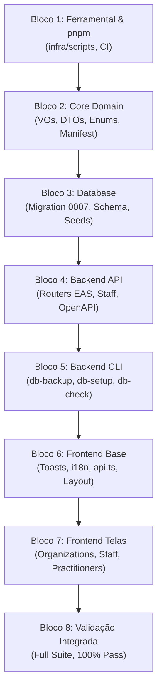

# Relatório Técnico: Integração de Melhorias do Laboratório (`openclinic-template` & `stash@{0}`) no OpenClinic Oficial

**Data de Conclusão:** 2026-09-29  
**Branch de Integração:** `feature/integrate-lab-improvements`  
**Branch Base:** `feature/auth` (`0995f2e`)  
**Tag de Restauração / Snapshot:** `backup-pre-integration-bcd6938`  
**Status do Stash de Backup:** Preservado (`stash@{0}`)  
**Gerenciador de Pacotes:** `pnpm` v11.25.0 (Monorepo Workspaces)

---

## 1. Contexto e Motivação

O repositório colaborativo oficial (`openclinic-oficial`) continha os trabalhos avançados da branch `feature/auth` desenvolvidos pelo colaborador Rômulo (commits `dac6dbc..0995f2e`: agendamento, salas, procedimentos, unidades, disponibilidades e blocos de agenda) e commits recentes de Iran (`bcd6938`). Paralelamente, no ambiente de laboratório (`openclinic-template`) e no `stash@{0}`, haviam evoluído melhorias cruciais:

1. Estrutura canônica de Estabelecimentos de Saúde (EAS Organizações e Unidades CNES).
2. Módulo de Staff / Colaboradores e Qualificações.
3. Reformulação completa de Profissionais de Saúde (Practitioners) com suporte a múltiplos conselhos de classe (CRM, CRO, COREN, etc.), RQE e especialidades médicas CBO.
4. Sistema de notificações leves (Toasts).
5. Migração de ferramental de setup para `infra/scripts/` e adoção do `pnpm workspaces`.

A meta foi conciliar e integrar todo esse ecossistema no repositório oficial com **zero regressão**, sem quebrar ou sobrescrever os módulos desenvolvidos por Rômulo e assegurando retrocompatibilidade total.

---

## 2. Metodologia de Execução em 8 Blocos

A integração foi executada estritamente em blocos atômicos, com validações unitárias e testes em cada etapa:

### Síntese dos Blocos Executados

| Bloco | Commit | Descrição da Entrega |
| --- | --- | --- |
| **1. Ferramental & Workspaces** | `c8d28a2` | Adoção do `pnpm` workspaces; limpeza da raiz movendo scripts de setup para `infra/scripts/`; modernização de workflows CI (`.github/workflows/ci.yml`). |
| **2. Core Domain** | `8f3b0f1` | Inclusão de VOs de Conselhos Regionais e RQE; DTOs de EAS Organizações e Unidades; expansão canônica de `APP_RESOURCE_MANIFEST` preservando todos os módulos de Agenda e Procedimentos de Rômulo. |
| **3. Banco de Dados** | `096160c` | Schema Drizzle com 7 novas tabelas (`appSpecialties`, `appPractitionerRegistrations`, `appPractitionerSpecialties`, `appPractitionerQualifications`, `appPractitionerAvailability`, `appStaff`, `appStaffQualifications`); geração da migração idempotente `0007_organizations_eas_and_staff_structure.sql`; validação de 31 tabelas públicas e integridade de FKs em container Docker descartável. |
| **4. Backend API** | `9ffeb39` | Routers de Organizações EAS (`/api/v1/business/organizations`), Staff (`/api/v1/business/staff`) e Especialidades (`/api/v1/business/specialties`); conciliação de rotas eliminando colisões com `room.router.ts`; atualização dos catálogos OpenAPI 3.0 (`docs/openapi/openapi.json` e `.yaml`). |
| **5. Backend CLI** | `8c8391c` | Preservação integral do comando `db-check` (testado e aprovado com status CONNECTED); enriquecimento de `db-backup` com flags de secrets provider e automação não-interativa. |
| **6. Frontend Base** | `5628768` | Sistema nativo de Toasts (`Toast.tsx`, `ToastContext.tsx`); expansão do `api.ts` com métodos clínicos e operacionais; harmonização dos catálogos i18n (`pt-br.ts` e `en-us.ts`) com 980 chaves (320+ novas chaves sem perda das existentes); compatibilização de tipos de auth. |
| **7. Frontend Telas** | `114d8b3` | Telas de Organizações Master-Detail (`OrganizationsView.tsx`), Staff (`StaffView.tsx`) e Profissionais de Saúde (`PractitionersView.tsx`); modais modulares; `Tooltip` no design system; constantes `ERROR_CODE` nos 11 VOs do Core; roteamento canônico em `DashboardPage.tsx`. |
| **8. Validação Integrada** | Atual | Auditoria final do monorepo, teste completo de 434 testes de backend e 97 testes do core, conferência git e memória técnica. |

---

## 3. Matriz de Preservação e Rastreabilidade

| Ativo / Módulo | Estado no Oficial Original | Decisão de Conciliação | Resultado Final |
| --- | --- | --- | --- |
| **Agendamento & Procedimentos** | `appointments`, `rooms`, `procedures`, `units`, `schedule-blocks` criados por Rômulo | Preservar 100% sem alterações funcionais | Mantidos intactos, validados por testes unitários dedicados. |
| **`db-check` CLI** | Implementado por Rômulo para diagnosticar conexões App DML e Owner DDL | Preservar integralmente | Mantido e funcional (`pnpm --filter @openclinic/backend-cli db-check`). |
| **Migrações 0000..0006** | Aplicadas no oficial por Rômulo | Preservar como imutáveis | Novas tabelas isoladas na migração `0007_organizations_eas_and_staff_structure.sql`. |
| **Navegação & Roteamento** | Menus com códigos legados (`base_staff`, `base_procedures`, etc.) | Aceitar códigos canônicos (`registries_*`) com fallback retrocompatível | Sidebar e Dashboard aceitam tanto os códigos legados quanto os canônicos. |
| **Localhost vs Remote DB** | Conforme diretriz do usuário, os bancos devem ter a mesma estrutura atualizada | Schema unificado e migrações idempotentes | Pronto para aplicação em banco remoto via `pnpm --filter @openclinic/backend-cli db:migrate`. |

---

## 4. Resultados da Validação Técnica

1. **Build do Monorepo:**
   - `@openclinic/core`: Compilação TypeScript bem-sucedida.
   - `@openclinic/backend-api`: Compilação TypeScript bem-sucedida.
   - `@openclinic/backend-cli`: Compilação TypeScript bem-sucedida.
   - `@openclinic/frontend-webapp`: Compilação TypeScript e bundle Vite concluídos sem alertas impeditivos.
2. **Suíte de Testes Unitários do Backend:**
   - **27 arquivos de teste, 434 testes executados, 434 testes aprovados (100% de sucesso).**
3. **Suíte de Testes Unitários do Core:**
   - **6 arquivos de teste, 97 testes executados, 97 testes aprovados (100% de sucesso).**
4. **Git Tree:**
   - Branch isolada `feature/integrate-lab-improvements` limpa (`nothing to commit, working tree clean`).
   - `stash@{0}` preservado intacto.
   - Tag `backup-pre-integration-bcd6938` preservada como ponto de restauração instantâneo.
