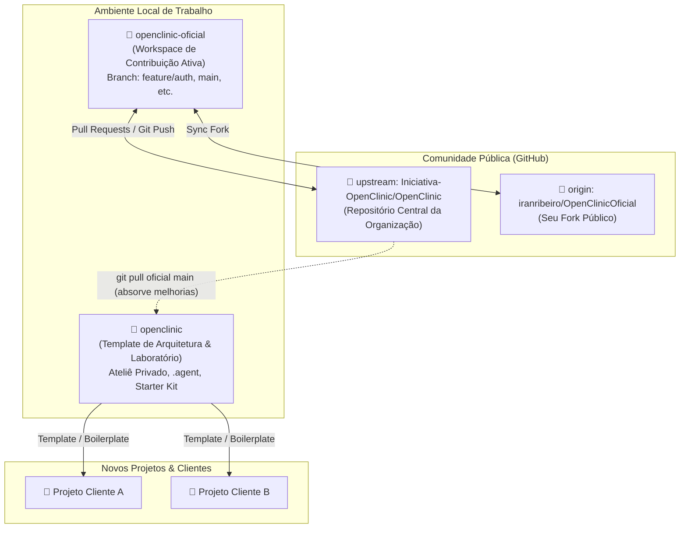

# 🌐 Estratégia de Workflow Open Source e Gestão de Template Arquitetural

> **Data:** 10 de Setembro de 2026  
> **Status:** Ativo / Canônico  
> **Escopo:** Diretrizes de trabalho colaborativo no ecossistema Open Source GitHub (`Iniciativa-OpenClinic/OpenClinic`), isolamento de dados e governança do repositório local como template base para novos projetos.

---

## 📑 1. Contexto e Topologia dos Repositórios

O ecossistema de desenvolvimento do projeto está estruturado em uma **topologia de duplo repositório** com propósitos distintos e complementares:



---

## 🏛 2. Papéis e Responsabilidades dos Repositórios

### 2.1 `openclinic-oficial` (Repositório de Contribuição Pública)

- **Propósito:** É a sua bancada de trabalho oficial como desenvolvedor e mantenedor da **Iniciativa OpenClinic**.
- **O que reside aqui:**
  - Código limpo, neutro e 100% auditado para consumo público.
  - Branches específicas de features e correções (ex.: `feature/auth`, `feature/clinical-core`).
  - Documentação institucional oficial e governança da comunidade (`GOVERNANCE.md`, `docs/decisions/`).
- **O que NUNCA deve residir aqui:**
  - Segredos reais, chaves de API privadas ou arquivos `.env` com senhas de produção.
  - Metadados ou automações proprietárias corporativas (regras de IA internas, orquestrações enterprise).
  - Dumps de banco de dados ou dados reais de pacientes.

### 2.2 `openclinic` (Template Arquitetural & Laboratório Privado)

- **Propósito:** É o seu **Starter Kit / Template Monorepo**, servindo como base sólida e reutilizável para o nascimento de novos sistemas e produtos para outros clientes e domínios.
- **O que reside aqui:**
  - Toda a arquitetura do Monorepo TypeScript (Fastify + React 19 + Drizzle ORM).
  - Suas configurações avançadas de IA e agentes (`.agent/`, regras customizadas).
  - Stacks de infraestrutura customizadas (Docker Swarm, Kestra, Portainer corporativo).
  - Anotações técnicas, histórico e dados de testes avançados.

---

## 🛡 3. Isolamento e Proteção de Dados: Por que o Banco Local Não Sobe para o GitHub

Uma das principais dúvidas no modelo colaborativo é o risco de subir dados locais para o repositório público:

1. **Camada de Dados Docker (Volumes Desacoplados):**
   - O banco de dados PostgreSQL roda dentro de containers Docker.
   - Os dados das tabelas ficam gravados em **volumes Docker gerenciados** no subsistema do host (`pg_data`) ou em diretórios locais explicitamente fora da árvore do Git.
   - O Git rastreia apenas código fonte (arquivos `.sql`, `.ts`, `.json`), **nunca os arquivos binários do PostgreSQL**.
2. **Blindagem Rigorosa no `.gitignore`:**
   - O `.gitignore` de ambos os projetos proíbe terminantemente:
     - `.env`, `.env.*` (apenas `.env.example` é versionado).
     - `*.dump`, `*.sql.gz`, `backups/`, `.temp/`.
     - Logs de execução e depuração (`*.log`).
3. **Dados de Demonstração (Seeds) vs Dados Reais:**
   - O repositório público possui apenas scripts declarativos com dados puramente fictícios de teste (`superadmin`, `ana.souza`, etc.).
   - Dados clínicos inseridos por você na interface local nunca trafegam nos commits.

---

## 🔄 4. Fluxo de Trabalho do Dia a Dia (Guia Prático)

### 4.1 Cenário A: Ajustes no PR #24 ou Desenvolvimento para o OpenClinic

Sempre que você for trabalhar no produto OpenClinic (responder a reviews, corrigir bugs ou criar novas features da comunidade):

1. **Abra diretamente a pasta `openclinic-oficial`**.
2. Garanta que está na branch correta:

   ```bash
   cd c:\Users\iranr\Development\OpenSource\openclinic-oficial
   git checkout feature/auth
   ```

3. Realize as modificações no código, rode os testes (`npm test`) e faça o commit:

   ```bash
   git commit -m "fix(auth): adjust permission guard based on code review"
   git push upstream feature/auth
   ```

4. O Pull Request no GitHub será atualizado automaticamente em tempo real.

### 4.2 Cenário B: Criar uma Nova Feature após o Merge da `main`

Quando o PR #24 for aprovado e mergeado na branch `main`:

```bash
cd c:\Users\iranr\Development\OpenSource\openclinic-oficial
git checkout main
git pull upstream main
git checkout -b feature/clinical-patients
```

### 4.3 Cenário C: Sincronizar o seu Template Local (`openclinic-template`) com o Oficial

Para manter o seu template base atualizado com as melhorias contínuas aprovadas pela comunidade OpenClinic, sem precisar de cópias manuais de arquivos:

1. Adicione o repositório oficial como remote dentro da pasta `openclinic-template`:

   ```bash
   cd c:\Users\iranr\Development\OpenSource\openclinic-template
   git remote add oficial https://github.com/Iniciativa-OpenClinic/OpenClinic.git
   ```

2. Para absorver melhorias da `main` oficial para o seu template:

   ```bash
   git fetch oficial
   git merge oficial/main --no-commit
   ```

#### (O parâmetro `--no-commit` permite que você inspecione as diferenças antes de efetivar o merge, preservando suas configurações privadas intactas)

### 4.4 Cenário D: Gerar um Novo Projeto para Outro Cliente a Partir do Template

Quando surgir um novo projeto (seja clínico, financeiro ou ERP):

1. Copie a estrutura base do `openclinic-template` (excluindo a pasta `.git`):
   - Mantenha os 4 pacotes do Monorepo (`core`, `backend-api`, `backend-cli`, `frontend-webapp`).
   - Mantenha a esteira Docker e o versionamento DDL com Drizzle ORM.
2. Inicie um novo repositório Git limpo no destino:

   ```bash
   cd c:\Users\iranr\Development\NovoProjeto
   git init
   git commit -m "chore: initial project scaffold based on enterprise monorepo template"
   ```

---

## 📌 5. Matriz de Decisão Rápida

| Preciso fazer... | Qual repositório abrir? | Ação / Comando |
| :--- | :--- | :--- |
| Ajustar algo apontado no PR #24 | `openclinic-oficial` | Editar, `npm test`, `git commit` e `git push upstream feature/auth`. |
| Implementar uma nova issue do OpenClinic | `openclinic-oficial` | Criar nova branch a partir da `main` atualizada. |
| Testar uma nova biblioteca ou arquitetura sem expor publicamente | `openclinic` | Trabalhar no branch local, testar e documentar. |
| Atualizar o meu template com correções feitas na comunidade | `openclinic` | `git fetch oficial && git merge oficial/main`. |
| Criar um novo sistema para um cliente | `openclinic` | Usar como base limpa inicial (scaffold). |
