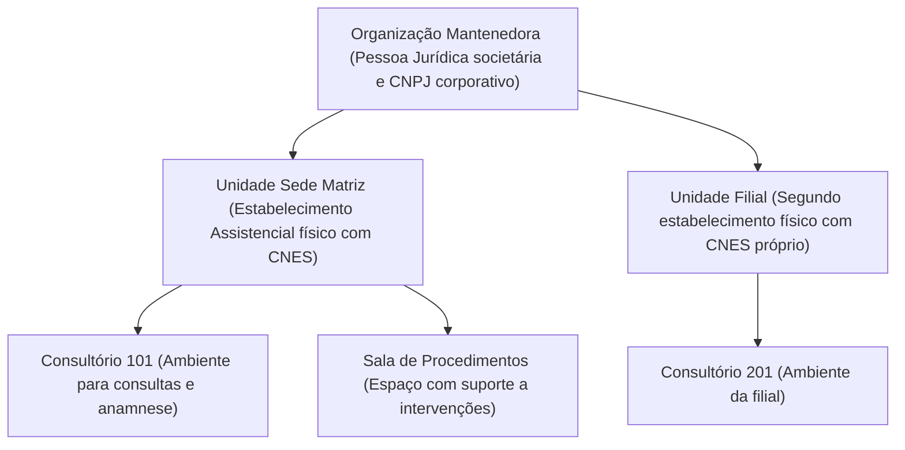

# Arquitetura Assistencial do OpenClinic: Organizações, Estabelecimentos de Saúde (EAS) e Salas

Este documento estabelece o modelo conceitual, regulatório e operacional da estrutura de cadastros do OpenClinic. Ele orienta gestores clínicos, administradores de instâncias e desenvolvedores sobre a distinção jurídica e sanitária entre a **Organização (Pessoa Jurídica Mantenedora)**, a **Unidade (Estabelecimento Assistencial de Saúde - EAS)** e os **Espaços Assistenciais (Salas e Consultórios)**.

---

## 1. Fundamentação Regulatória no Brasil

A estrutura de dados e navegação do OpenClinic foi projetada em estrita conformidade com a legislação sanitária brasileira e as diretrizes do Ministério da Saúde:

1. **Lei Federal nº 8.080/1990 (Lei Orgânica da Saúde):**
   - Determina que toda ação assistencial em saúde pública ou privada deve ser exercida em estabelecimentos devidamente cadastrados e fiscalizados pela vigilância sanitária.
2. **Portaria de Consolidação MS nº 1/2017 e Manual Técnico do CNES (DATASUS):**
   - O **Cadastro Nacional de Estabelecimentos de Saúde (CNES)** é obrigatório para todo e qualquer local físico onde se prestam serviços de assistência à saúde no território nacional, independentemente do porte.
   - O CNES é emitido **por endereço físico e alvará sanitário**, vinculado a um **Responsável Técnico (RT)** médico com registro ativo no CRM da jurisdição.
3. **ANVISA RDC nº 50/2002 (Regulamento Técnico de Planejamento Físico de Estabelecimentos Assistenciais de Saúde):**
   - Classifica os espaços físicos em **Ambientes Assistenciais**, distinguindo:
     - **Consultório:** Destinado exclusivamente à anamnese e exame clínico não invasivo.
     - **Salas de Procedimentos / Exames / Cirurgia:** Ambientes com exigências sanitárias especiais de descarte biológico (RDC 222/2018), esterilização e assepsia.
4. **Resolução CFM nº 2.299/2021 e Certificação SBIS (Padrão de Prontuário Eletrônico - ECF):**
   - Exigem que toda receita médica, atestado, laudo de exame e prontuário contenha a identificação clara do **CNES do estabelecimento** onde o ato médico foi realizado, além do CRM e RQE do médico assistente.

---

## 2. A Distinção Canônica: Organização vs Unidade de Saúde (EAS)

> **Pergunta Frequente:** *"Por que a própria Organização não pode ser a sede de atendimento? Por que precisamos de uma Unidade separada?"*

A razão decorre da separação fundamental entre **entidade societária/fiscal** e **estabelecimento assistencial sanitário**:

| Dimensão | 🏢 Organização (Mantenedora) | 📍 Unidade de Saúde (EAS) |
| :--- | :--- | :--- |
| **Natureza Jurídica** | Pessoa Jurídica societária (Contrato Social / Estatuto). | Estabelecimento físico assistencial em saúde. |
| **Órgão de Registro** | Junta Comercial / Receita Federal do Brasil (CNPJ). | Ministério da Saúde / DATASUS (CNES) e Vigilância Sanitária local. |
| **Endereço** | Sede corporativa, escritório administrativo ou contábil. | Endereço físico onde ocorrem os atendimentos aos pacientes. |
| **Responsabilidade Técnica** | Diretoria jurídica, sócios-administradores ou procuradores. | Responsável Técnico (RT) com registro no CRM / COREN / CFO. |
| **Prática Clínica** | **Não realiza atendimento clínico diretamente.** | **Local onde ocorrem consultas, exames e procedimentos.** |
| **Alvará Sanitário** | Não possui (salvo se coincidir com o imóvel do EAS). | Obrigatório (Licença de Funcionamento e Alvará Sanitário). |
| **Receitas e Prontuários** | Não pode constar isoladamente em receitas médicas. | Obrigatória a impressão do seu CNES em receituários e guias TISS. |

### Implicações Práticas
- Uma mantenedora (ex: *Rede de Clínicas São Paulo Ltda.*) possui **um único CNPJ corporativo** perante a Receita Federal, mas pode possuir **três unidades de atendimento** (ex: *Unidade Paulista*, *Unidade Jardins*, *Unidade Alphaville*).
- Cada uma dessas unidades possui um **endereço diferente**, um **código CNES exclusivo** emitido pelo DATASUS e, frequentemente, um **Responsável Técnico local** distinto.
- Mesmo no caso de um consultório individual ou clínica com endereço único, a conformidade sanitária exige a existência do cadastro do **Estabelecimento Assistencial (EAS)** com seu CNES para a geração válida de prontuários e faturamento TISS.

---

## 3. Estrutura Hierárquica em 3 Níveis

O OpenClinic organiza o ecossistema assistencial através de uma árvore canônica de três níveis:

### Nível 1: Organização (`Organization`)
- Identificação da Pessoa Jurídica contratante.
- Guarda os dados de CNPJ, Inscrição Municipal, Inscrição Estadual, razão social e sede societária.
- Controla políticas globais, isolamento de dados e governança multi-tenancy.

### Nível 2: Unidade de Atendimento (`OrganizationUnit` / EAS)
- Representa o estabelecimento físico de prestação de serviços de saúde.
- Possui código CNES de 7 dígitos validado pelo DATASUS.
- Classificada obrigatoriamente como **Sede (Matriz assistencial)** ou **Filial**.
- Cada organização deve conter no mínimo uma unidade designada como Sede.

### Nível 3: Sala / Consultório (`Room` / Espaço Assistencial)
- Subdivisão física e operacional dentro de uma unidade de saúde.
- Classificada conforme a RDC 50 da ANVISA pelo seu tipo: *Consultório*, *Procedimento*, *Exame*, *Triagem*, *Cirurgia*, *Atendimento* ou *Outro*.
- Vinculada ao agendamento de consultas na agenda clínica (`isSchedulable`).

---

## 4. O Recurso de Provisionamento Automático da Sede

Para facilitar o cadastramento inicial e evitar retrabalho a clínicas unificadas e consultórios individuais, o formulário de cadastro de organização oferece a funcionalidade:

> **"Criar automaticamente a Unidade Sede com os dados cadastrais"**
> *Gera a primeira unidade de atendimento (Sede / Matriz) copiando nome, CNPJ e endereço da organização.*

### Como funciona:
1. Ao preencher os dados da organização e manter o checkbox ativado (padrão), o sistema cria a Pessoa Jurídica e gera instantaneamente a **Unidade Sede**.
2. O nome da unidade é formatado automaticamente como `[Nome Fantasia] (Sede)`.
3. Todos os campos de logradouro, número, bairro, cidade, UF, CEP e telefone são replicados.
4. É criado um código CNES provisório para que o gestor possa complementá-lo posteriormente com o número emitido pela Vigilância Sanitária/DATASUS.
5. Um **Consultório Principal (Consultório 01)** é imediatamente instanciado para que a agenda e o cadastro de profissionais possam ser utilizados de imediato.

---

## 5. Regras de Integridade e Proteção (Bottom-Up Deletion)

Para garantir a rastreabilidade médica e evitar a criação de prontuários órfãos, o OpenClinic aplica as seguintes regras de proteção:

1. **Exclusão de Baixo para Cima (Bottom-Up):**
   - Não é permitido excluir uma **Unidade** enquanto houver salas/consultórios cadastrados nela.
   - Não é permitido excluir uma **Organização** enquanto houver unidades de atendimento ativas vinculadas.
2. **Proteção da Unidade Sede:**
   - A unidade marcada como **Sede / Matriz** não pode ser desativada ou excluída se houver filiais ativas na organização. Para transferir a sede, o administrador deve editar a nova filial e promovê-la a Sede.
3. **Desativação Segura (Soft-Delete):**
   - Organizações e Unidades desativadas permanecem auditáveis no banco de dados para cumprimento do prazo legal de guarda de prontuários (mínimo de 20 anos, conforme Lei Federal nº 13.787/2018).
